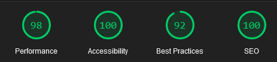

VhiWEB Frontend Test Case

Ini adalah jawaban Test Case untuk Posisi Frontend dari VhiWEB, dimana saya membuat single page application (SPA) dengan menggunakan React sebagai library utamanya, dan SCSS sebagai preprocessor CSS nya.

App ini terdiri dari 3 halaman yg terdiri dari masing-masing 1 komponen, yaitu Halaman Login, Users, dan user details. Berikut rincian mengenai ketiga halaman tersebut:

- Login Page: Halaman ini dibuat untuk mengotentikasi user sebelum masuk ke dalam app nya, namun saat ini fitur otentikasinya belum bekerja dan user bisa pergi ke halaman selanjutnya, yaitu halaman users dengan menekan tombol Login.

- Users Page: Di halaman ini, daftar dari pengguna regres ditampilkan dengan mengambil datanya dari https://reqres.in/api/users dengan menggunakan metode fetch() dari javascript dan menyimpan datanya sebagai state yang kemudian ditampilkan dengan metode .map(). User bisa pergi ke halaman selanjutnya dengan mengklik salah satu card yang ditampilkan

- User Detail Page: Di Halaman ini, Detail dari card pengguna akan ditampilkan secara individu. data yang ditampilkan diambil dari state yang berasal dari halaman sebelumnya dengan menggunakan Hook useLocation()

Berikut skor yang didapat dari lighthouse   
   
